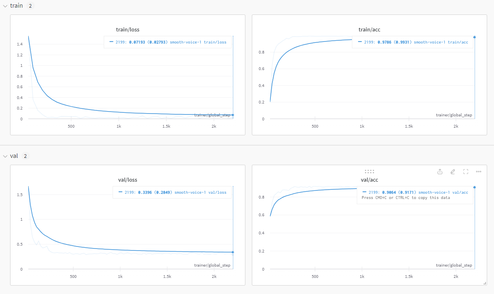

<h1 align="center">C3D</h1>
This repository contains my personal code for the paper <a href="https://arxiv.org/abs/1412.0767" target="_blank">Learning Spatiotemporal Features with 3D Convolutional Networks</a> by Du Tran, Lubomir Bourdev, Rob Fergus, Lorenzo Torresani, Manohar Paluri.

<p align="center">
  	<table style="border:0px">
        <tr>
            <td></td>
            <td></td>
        </tr>
    </table>
</p>

C3D model is implemented in PyTorch (1.12.1) and PyTorch Lightning (2.0.8).
Currently, the code supports training on [UCF101](https://www.crcv.ucf.edu/data/UCF101.php).

## Installation
The code was tested with Python 3.9.17 and Anaconda. To install the dependencies, run:

```bash
conda env create -f environment.yml
conda activate c3d
```


## Dataset
Create a directory called `dataset` and download the UCF101 dataset.

```bash
mkdir dataset
cd dataset
```

To download the UCF101 dataset, run:

```bash
wget https://www.crcv.ucf.edu/data/UCF101/UCF101.rar --no-check-certificate
```

Make sure that dataset directory has the following structure:

```bash
UCF-101
├── ApplyEyeMakeup
│   ├── v_ApplyEyeMakeup_g01_c01.avi
│   └── ...
├── ApplyLipstick
│   ├── v_ApplyLipstick_g01_c01.avi
│   └── ...
└── Archery
│   ├── v_Archery_g01_c01.avi
│   └── ...
```

After run the tests to make sure everything is working:

```bash
pytest -q test/test.py
```
It will take a while to run the tests, because it will preprocess the dataset.


## Pre-Trained Model
Create a directory called `models`, [download](https://drive.google.com/file/d/1fDmxp3Mlq9zNbtGUW4jVFKJ0xMJG7nIJ/view?usp=sharing) the pre-trained model and put it inside the `models` directory.


## Training
To train the model, run:

```bash
python train.py

Usage: train.py [OPTIONS]

Options:
  --dataset TEXT               This is the dataset name.
  --epochs INTEGER             This is the number of epochs.
  --test                       This is the test flag.
  --snapshot_interval INTEGER  This is the snapshot interval.
  --batch_size INTEGER         This is the batch size.
  --lr FLOAT                   This is the learning rate.
  --num_workers INTEGER        This is the number of workers.
  --clip_len INTEGER           This is the clip length.
  --preprocess BOOLEAN         This is the preprocess flag.
  --pretrained TEXT            This is the pretrained model path.
  --root_dir TEXT              This is the root directory of the dataset.
  --output_dir TEXT            This is the output directory.
  --device TEXT                This is the device.
  --seed INTEGER               This is the seed.
  --wandb_log                  This is the wandb flag.
  --checkpoint TEXT            This is the checkpoint path.
  --help                       Show this message and exit.
```
The training support logging with [WandB](https://wandb.ai/site). To enable logging, run:

```bash
python train.py --wandb_log
```


## Test
To test the model, run:

```bash
python train.py --test --epochs 0 --pretrained <path_to_pretrained_model>
```


## Inference
To infer the model, run:

```bash
python inference.py

Usage: inference.py [OPTIONS]

Options:
  --video TEXT    This is the video path.
  --output TEXT   This is the output folder.
  --device TEXT   This is the device to be used.
  -m TEXT         This is the model path.
  --classes TEXT  This is the classes path.
  --help          Show this message and exit.
```

## Results
The model was trained for $100$ epochs with a batch size of $100$ and a learning rate of $1e-3$. A NVIDIA TESLA V100 GPU was used for training. The model achieved a top-1 accuracy of $90.8\%$.

<p align="center">
  	
</p>
<p align="center">
  	
</p>

## References
- [Learning Spatiotemporal Features with 3D Convolutional Networks](https://arxiv.org/abs/1412.0767)
```bibtex
@inproceedings{tran2015learning,
  title={Learning spatiotemporal features with 3d convolutional networks},
  author={Tran, Du and Bourdev, Lubomir and Fergus, Rob and Torresani, Lorenzo and Paluri, Manohar},
  booktitle={Proceedings of the IEEE international conference on computer vision},
  pages={4489--4497},
  year={2015}
}
```